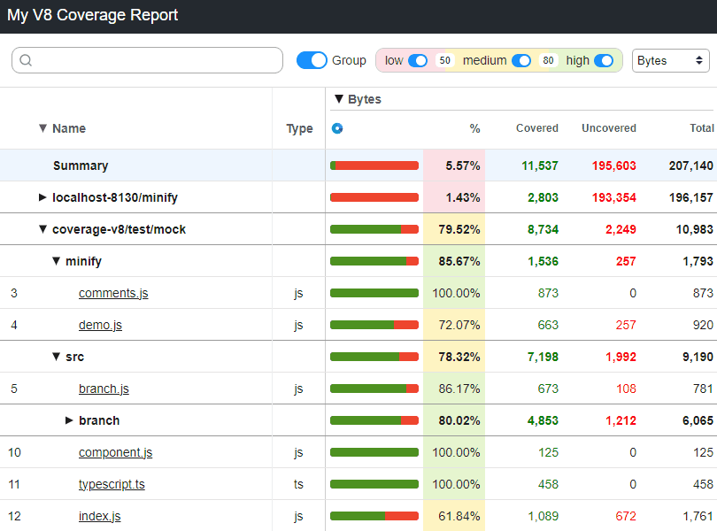
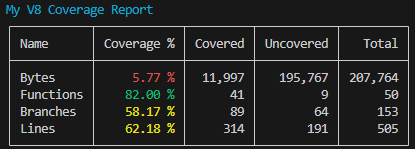

# Monocart Coverage Reports

[](https://www.npmjs.com/package/monocart-coverage-reports)
[](https://www.npmjs.com/package/monocart-coverage-reports)


> Code coverage tool to generate native [V8](https://v8.dev/blog/javascript-code-coverage) reports or [Istanbul](https://istanbul.js.org/) reports.

* [Usage](#usage)
* [Default Options](#default-options)
* [Available Reports](#available-reports)
* [Multiprocessing Support](#multiprocessing-support)
* [onEnd Hook](#onend-hook)
* [Compare Reports](#compare-reports)
* [Compare Workflows](#compare-workflows)
* [Collecting Istanbul Coverage Data](#collecting-istanbul-coverage-data)
* [Collecting V8 Coverage Data](#collecting-v8-coverage-data)
* [Node.js V8 Coverage Report for Server Side](#nodejs-v8-coverage-report-for-server-side)
* [Using `entryFilter` and `sourceFilter` to filter the results for V8 report](#using-entryfilter-and-sourcefilter-to-filter-the-results-for-v8-report)
* [How to convert V8 to Istanbul](#how-to-convert-v8-to-istanbul)
    - [Using `v8-to-istanbul`](#using-v8-to-istanbul)
    - [How Monocart Works](#how-monocart-works)
* [Ignoring Uncovered Lines](#ignoring-uncovered-lines)
* [Chromium Coverage API](#chromium-coverage-api)
* [V8 Coverage Data Format](#v8-coverage-data-format)
* [Istanbul Introduction](#istanbul-introduction)
* [Thanks](#thanks)

## Usage
```js
const MCR = require('monocart-coverage-reports');
const options = {
    outputDir: './coverage-reports',
    reports: "v8"
}
const coverageReport = MCR(options);
await coverageReport.add(coverageData1);
await coverageReport.add(coverageData2);
const coverageResults = await coverageReport.generate();
console.log(coverageResults.summary);
```
- [example v8](https://github.com/cenfun/monocart-coverage-reports/blob/main/test/test-v8.js)
- [example istanbul](https://github.com/cenfun/monocart-coverage-reports/blob/main/test/test-istanbul.js)

## Default Options
- [lib/default/options.js](https://github.com/cenfun/monocart-coverage-reports/blob/main/lib/default/options.js)

## Available Reports
- `v8` (V8 data only)
    - [V8 html](https://cenfun.github.io/monocart-coverage-reports/v8) - Example for browser, build with webpack, and also [Rollup](https://cenfun.github.io/monocart-coverage-reports/v8-rollup) and [Esbuild](https://cenfun.github.io/monocart-coverage-reports/v8-esbuild)
    - [V8 Node](https://cenfun.github.io/monocart-coverage-reports/v8-node-env) - Example for Node.js using env, and also [V8 API](https://cenfun.github.io/monocart-coverage-reports/v8-node-api), [Inspector](https://cenfun.github.io/monocart-coverage-reports/v8-node-ins) and [CDP](https://cenfun.github.io/monocart-coverage-reports/v8-node-cdp)
    - [V8 Minify](https://cenfun.github.io/monocart-coverage-reports/v8-minify)



- `v8-json` (V8 data only)
    - [V8 coverage-report.json](https://cenfun.github.io/monocart-coverage-reports/v8-and-istanbul/coverage-report.json)
- `console-summary` shows coverage summary in console
    
    

> Following are [istanbul reports](https://github.com/istanbuljs/istanbuljs/tree/master/packages/istanbul-reports/lib)
- `clover`
- `cobertura`
- `html`
    - [Istanbul html](https://cenfun.github.io/monocart-coverage-reports/istanbul/) 
    - [V8 to Istanbul](https://cenfun.github.io/monocart-coverage-reports/v8-and-istanbul/istanbul)
- `html-spa`
    - [Istanbul html-spa](https://cenfun.github.io/monocart-coverage-reports/istanbul/html-spa/)
- `json`
- `json-summary`
- `lcov`
- `lcovonly`
    - [V8 lcov.info](https://cenfun.github.io/monocart-coverage-reports/v8/lcov.info)
    - [Istanbul lcov.info](https://cenfun.github.io/monocart-coverage-reports/istanbul/lcov.info)
- `none`
- `teamcity`
- `text`
- `text-lcov`
- `text-summary`

```js
const MCR = require('monocart-coverage-reports');
const options = {
    outputDir: './coverage-reports',
    reports: [
        ['console-summary'],
        ['v8'],
        ['html', {
            subdir: 'istanbul'
        }],
        ['json', {
            file: 'my-json-file.json'
        }],
        'lcovonly'
    ]
}
const coverageReport = MCR(options);
```

## Integration
- [monocart-reporter](https://cenfun.github.io/monocart-reporter/) - Test reporter for [Playwright](https://github.com/microsoft/playwright)
- [vitest-monocart-coverage](https://github.com/cenfun/vitest-monocart-coverage) - Integration with [Vitest](https://github.com/vitest-dev/vitest) coverage


## Multiprocessing Support
The data will be added to `[outputDir]/.cache`, and the cache will be removed after reports generated.
- sub process 1
```js
const MCR = require('monocart-coverage-reports');
const options = require('path-to/same-options.js');
const coverageReport = MCR(options);
await coverageReport.add(coverageData1);
```

- sub process 2
```js
const MCR = require('monocart-coverage-reports');
const options = require('path-to/same-options.js');
const coverageReport = MCR(options);
await coverageReport.add(coverageData2);
```

- main process
```js
// after all sub processes finished
const MCR = require('monocart-coverage-reports');
const options = require('path-to/same-options.js');
const coverageReport = MCR(options);
const coverageResults = await coverageReport.generate();
console.log(coverageResults.summary);
```

## onEnd Hook
For example, checking thresholds:
```js
const EC = require('eight-colors');
const coverageOptions = {
    name: 'My Coverage Report',
    outputDir: './coverage-reports',
    onEnd: (coverageResults) => {
        const thresholds = {
            bytes: 80,
            lines: 60
        };
        console.log('check thresholds ...', thresholds);
        const errors = [];
        const { summary } = coverageResults;
        Object.keys(thresholds).forEach((k) => {
            const pct = summary[k].pct;
            if (pct < thresholds[k]) {
                errors.push(`Coverage threshold for ${k} (${pct} %) not met: ${thresholds[k]} %`);
            }
        });
        if (errors.length) {
            const errMsg = errors.join('\n');
            console.log(EC.red(errMsg));
            // throw new Error(errMsg);
            // process.exit(1);
        }
    }
}
```

## Compare Reports
| | Istanbul | V8 | V8 to Istanbul |
| :--------------| :------ | :------ | :----------------------  |
| Coverage data | [Istanbul](https://github.com/gotwarlost/istanbul/blob/master/coverage.json.md) (Object) | [V8](#v8-coverage-data-format) (Array) | [V8](#v8-coverage-data-format) (Array) |
| Output | [Istanbul reports](#available-reports) | [V8 reports](#available-reports)  | [Istanbul reports](#available-reports) |
| - Bytes | ❌ | ✅ | ❌ |
| - Statements | ✅ | ❌ | ☑️❔ |
| - Branches | ✅ | ☑️❔ | ☑️❔ |
| - Functions | ✅ | ✅ | ✅ |
| - Lines | ✅ | ✅ | ✅ |
| - Execution counts | ✅ | ✅ | ✅ |
| CSS coverage | ❌ | ✅ | ✅ |
| Minified code | ❌ | ✅ | ❌ |

❔ - Partial or conditional support

## Compare Workflows
- Istanbul Workflows
    - 1, [Collecting Istanbul coverage data](#collecting-istanbul-coverage-data)
    - 2, Adding coverage data and generating coverage report

- V8 Workflows
    - 1, [Collecting V8 coverage data](#collecting-v8-coverage-data)
    - 3, Adding coverage data and generating coverage report

## Collecting Istanbul Coverage Data
- Instrumenting source code
    > Before collecting Istanbul coverage data, It requires your source code is instrumented with Istanbul
    - Webpack: [babel-plugin-istanbul](https://github.com/istanbuljs/babel-plugin-istanbul), example: [webpack.config-istanbul.js](https://github.com/cenfun/monocart-coverage-reports/blob/main/test/webpack.config-istanbul.js)
    - Rollup: [rollup-plugin-istanbul](https://github.com/artberri/rollup-plugin-istanbul)
    - Vite: [vite-plugin-istanbul](https://github.com/ifaxity/vite-plugin-istanbul)
- Browser
    > Collecting coverage data from `window.__coverage__`, example: [test-istanbul.js](https://github.com/cenfun/monocart-coverage-reports/blob/main/test/test-istanbul.js)
- Node.js
    > Collecting coverage data from `global.__coverage__`

## Collecting V8 Coverage Data
- For source code: enable `sourcemap` and do not compress/minify:
    - Webpack: build with `source-map` [devtool](https://webpack.js.org/configuration/devtool/) and `development` [mode](https://webpack.js.org/configuration/mode/), example [webpack.config-v8.js](https://github.com/cenfun/monocart-coverage-reports/blob/main/test/webpack.config-v8.js)
    - Rollup: build with [options](https://rollupjs.org/configuration-options/) `sourcemap: true`
    - Vite: build with [options](https://vitejs.dev/config/build-options.html) `sourcemap: true` and `minify: false` 
- Browser (Chromium Only)
    > Collecting coverage data with [Chromium Coverage API](#chromium-coverage-api), see [example](https://github.com/cenfun/monocart-coverage-reports/blob/main/test/test-v8.js)
- Node.js
    > see [Node.js V8 Coverage Report for Server Side](#nodejs-v8-coverage-report-for-server-side)


## Node.js V8 Coverage Report for Server Side
- Node.js env [NODE_V8_COVERAGE](https://nodejs.org/docs/latest/api/cli.html#node_v8_coveragedir)=`dir`
    - Before running your Node.js application, set env `NODE_V8_COVERAGE`=`dir`. After the application runs and exits, the coverage data will be saved to the `dir` directory in JSON file format
    - Read the json file(s) from the `dir` and generate coverage report
    - example:
    > cross-env NODE_V8_COVERAGE=`.temp/v8-coverage-env` node [./test/test-node-env.js](./test/test-node-env.js) && node [./test/generate-node-report.js](./test/generate-node-report.js)

- [V8](https://nodejs.org/docs/latest/api/v8.html#v8takecoverage) API + NODE_V8_COVERAGE
    - Writing the coverage started by NODE_V8_COVERAGE to disk on demand with `v8.takeCoverage()` and stopping with `v8.stopCoverage()`. 
    - example:
    > cross-env NODE_V8_COVERAGE=`.temp/v8-coverage-api` node [./test/test-node-api.js](./test/test-node-api.js)

- [Inspector](https://nodejs.org/docs/latest/api/inspector.html) API (or module [collect-v8-coverage](https://github.com/SimenB/collect-v8-coverage))
   - Connecting to the V8 inspector and enable V8 coverage.
   - Taking coverage data and adding to the report after your application runs.
   - example: [./test/test-node-ins.js](./test/test-node-ins.js)
   
- [CDP](https://chromedevtools.github.io/devtools-protocol/) API
    - Enabling [Node Debugging](https://nodejs.org/en/guides/debugging-getting-started/)
    - Collecting coverage data with CDP API.
    - example: [./test/test-node-cdp.js](./test/test-node-cdp.js)

- [Debugger](https://nodejs.org/en/guides/debugging-getting-started) + NODE_V8_COVERAGE + CDP + V8 API
    - example: [global-teardown.js](https://github.com/cenfun/nextjs-with-playwright/blob/main/global-teardown.js)

## Using `entryFilter` and `sourceFilter` to filter the results for V8 report
When V8 coverage data collected, it actually contains the data of all entry files, for example:
```
dist/main.js
dist/vendor.js
dist/something-else.js
```
We can use `entryFilter` to filter the entry files. For example, we should remove `vendor.js` and `something-else.js` if they are not in our coverage scope. 
```
dist/main.js
```
When inline or linked sourcemap exists to the entry file, the source files will be extracted from the sourcemap for the entry file, and the entry file will be removed if `logging` is not `debug`.
```
> src/index.js
> src/components/app.js
> node_modules/dependency/dist/dependency.js
```
We can use `sourceFilter` to filter the source files. For example, we should remove `dependency.js` if it is not in our coverage scope.
```
> src/index.js
> src/components/app.js
```
Example:
```js
const coverageOptions = {
    entryFilter: (entry) => entry.url.indexOf("main.js") !== -1,
    sourceFilter: (sourcePath) => sourcePath.search(/src\//) !== -1
};
```

## How to convert V8 to Istanbul
### Using [v8-to-istanbul](https://github.com/istanbuljs/v8-to-istanbul)
It is a popular library which is used to convert V8 coverage format to istanbul's coverage format. Most test frameworks are using it, such as [Jest](https://github.com/jestjs/jest/), [Vitest](https://github.com/vitest-dev/vitest), but it has two major problems:
- 1, The source mapping does not work well if the position is between the two consecutive mappings. for example: 
```js
const a = tf ? 'true' : 'false';
               ^     ^  ^
              m1     p  m2
```
> `m1` and `m2` are two consecutive mappings, `p` is the position we looking for. However, we can only get the position of the `m1` if we don't fix it to `p`. Especially the generated code is different from the original code, such as minified, compressed or converted, then it becomes very difficult to find the middle position between two mappings.

- 2, The coverage of functions and branches is incorrect. V8 only provided coverage at functions and it's blocks. But if a function is uncovered (count = 0), there is no information for it's blocks and sub-level functions.
And also there are some problems about counting the functions and branches:
```js
functions.forEach(block => {
    block.ranges.forEach((range, i) => {
        if (block.isBlockCoverage) {
            // v8-to-istanbul: new CovBranch() 
            // Problem: not every block is branch, and the first block is actually function.
            if (block.functionName && i === 0) {
                // v8-to-istanbul: new CovFunction()
                // Problem: no anonymous function
            }
        } else if (block.functionName) {
            // v8-to-istanbul: new CovFunction()
            // Problem: no anonymous function
        }
    }
});
// Problem: When the function or parent-level function is uncovered, then its sub-level functions will never be counted.
```
see source code [v8-to-istanbul.js](https://github.com/istanbuljs/v8-to-istanbul/blob/master/lib/v8-to-istanbul.js)

### How Monocart Works
We have removed `v8-to-istanbul` because of the two major problems and implemented new converter:
- 1, Trying to fix the middle position if not found the exact mapping.
- 2, Finding all functions and branches by parsing the source code [AST](https://github.com/acornjs/acorn), however the V8 cannot provide effective branch coverage information, so the branches is still not perfect.

| AST | V8 | 
| :--------------| :------ | 
| AssignmentPattern | 🛇 Not Support | 
| ConditionalExpression | ✔ Not Perfect | 
| IfStatement | ✔ Not Perfect | 
| LogicalExpression | ✔ Not Perfect | 
| SwitchStatement | ✔ Not Perfect | 

## Ignoring Uncovered Codes
To ignore codes, use the special comment which starts with `v8 ignore `:
- ignoring all until told
```js
/* v8 ignore start */
function uncovered() {
}
/* v8 ignore stop */
```
- ignoring the next line or next N lines
```js
/* v8 ignore next */
const os = platform === 'wind32' ? 'Windows' : 'Other';

const os = platform === 'wind32' ? 'Windows' /* v8 ignore next */ : 'Other';

// v8 ignore next 3
if (platform === 'linux') {
    console.info('hello linux');
}
```

## Chromium Coverage API
- [V8 coverage report](https://v8.dev/blog/javascript-code-coverage) - Native support for JavaScript code coverage to V8. (Chromium only)
- [Playwright Coverage Class](https://playwright.dev/docs/api/class-coverage)
- [DevTools Protocol for Coverage](https://chromedevtools.github.io/devtools-protocol/tot/Profiler/#method-startPreciseCoverage)

## V8 Coverage Data Format
```js
// Coverage data for a source range.
export interface CoverageRange {
    // JavaScript script source offset for the range start.
    startOffset: integer;
    // JavaScript script source offset for the range end.
    endOffset: integer;
    // Collected execution count of the source range.
    count: integer;
}

// Coverage data for a JavaScript function.
/**
 * @functionName can be an empty string.
 * @ranges is always non-empty. The first range is called the "root range".
 * @isBlockCoverage indicates if the function has block coverage information.
    If this is false, it usually means that the functions was never called.
    It seems to be equivalent to ranges.length === 1 && ranges[0].count === 0.
*/
export interface FunctionCoverage {
    // JavaScript function name.
    functionName: string;
    // Source ranges inside the function with coverage data.
    ranges: CoverageRange[];
    // Whether coverage data for this function has block granularity.
    isBlockCoverage: boolean;
}

// Coverage data for a JavaScript script.
export interface ScriptCoverage {
    // JavaScript script id.
    scriptId: Runtime.ScriptId;
    // JavaScript script name or url.
    url: string;
    // Functions contained in the script that has coverage data.
    functions: FunctionCoverage[];
}

export type V8CoverageData = ScriptCoverage[];
```
see devtools-protocol [ScriptCoverage](https://chromedevtools.github.io/devtools-protocol/tot/Profiler/#type-ScriptCoverage) and [v8-coverage](https://github.com/bcoe/v8-coverage)


## Istanbul Introduction
- [Istanbul coverage report](https://istanbul.js.org/) - Instrumenting source codes and generating coverage reports
- [babel-plugin-istanbul](https://github.com/istanbuljs/babel-plugin-istanbul)
- [istanbul-reports](https://github.com/istanbuljs/istanbuljs/tree/master/packages/istanbul-reports/lib)
- [Code Coverage Introduction](https://docs.cypress.io/guides/tooling/code-coverage)

## Thanks
- Special thanks to [@edumserrano](https://github.com/edumserrano)