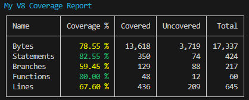
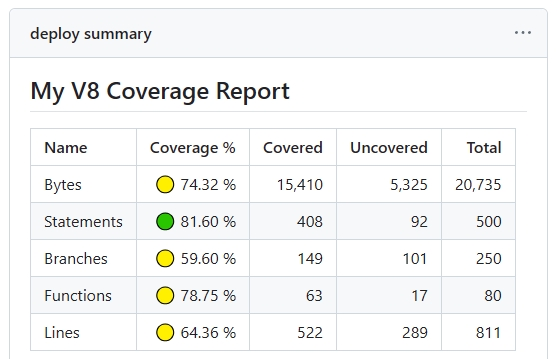
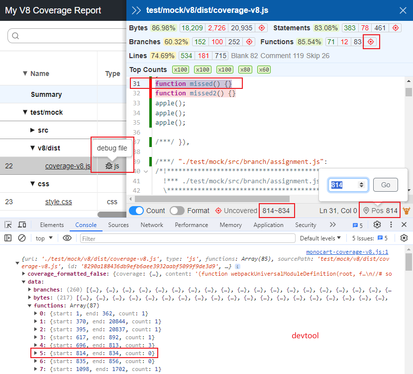
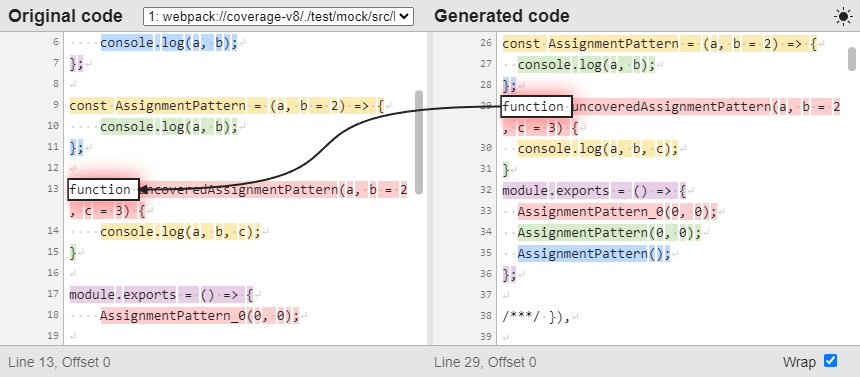

# Monocart Coverage Reports

[](https://www.npmjs.com/package/monocart-coverage-reports)


[](https://packagephobia.com/result?p=monocart-coverage-reports)
[](https://npmgraph.js.org/?q=monocart-coverage-reports)

[](https://www.npmjs.com/package/monocart-coverage-reports)

🌐 [English](README.md) | 简体中文

> JS代码覆盖率工具，用来生成原生的[V8](https://v8.dev/blog/javascript-code-coverage)或者[Istanbul](https://istanbul.js.org/)代码覆盖率报告

* [用法](#usage)
* [选项配置](#options)
* [所有支持的报告类型](#available-reports)
* [比较两种报告](#compare-reports)
* [如何收集Istanbul覆盖率数据](#collecting-istanbul-coverage-data)
* [如何收集V8覆盖率数据](#collecting-v8-coverage-data)
    - [用Playwright](#collecting-v8-coverage-data-with-playwright)
    - [用Puppeteer](#collecting-raw-v8-coverage-data-with-puppeteer)
    - [从Node.js](#collecting-v8-coverage-data-from-nodejs)
    - [使用`CDPClient`API](#collecting-v8-coverage-data-with-cdpclient-api)
    - [参考V8覆盖率的API](#v8-coverage-data-api)
* [过滤V8覆盖率数据](#filtering-results)
* [使用 `sourcePath` 修改源文件路径](#resolve-sourcepath-for-the-source-files)
* [为未测试的文件添加空的覆盖率报告](#adding-empty-coverage-for-untested-files)
* [onEnd回调函数](#onend-hook)
* [如何忽略未覆盖的代码](#ignoring-uncovered-codes)
* [多进程支持](#multiprocessing-support)
* [如何使用CLI命令行](#command-line)
* [如何加载配置文件](#config-file)
* [如何合并覆盖率报告](#merge-coverage-reports)
    - [自动合并](#automatic-merging)
    - [手动合并](#manual-merging)
* [常见问题](#common-issues)
    - [Unexpected coverage](#unexpected-coverage)
    - [Unparsable source](#unparsable-source)
    - [JavaScript heap out of memory](#javascript-heap-out-of-memory)
* [如何调试覆盖率数据和查看sourcemap](#debug-for-coverage-and-sourcemap)
* [如何跟其他框架集成](#integration-with-any-testing-framework)
* [集成的例子](#integration-examples)
    - [Playwright](#playwright)
    - [c8](#c8)
    - [CodeceptJS](#codeceptjs)
    - [VSCode](#vscode)
    - [Jest](#jest)
    - [Vitest](#vitest)
    - [Node Test Runner](#node-test-runner)
    - [Puppeteer](#puppeteer)
    - [Cypress](#cypress)
    - [WebdriverIO](#webdriverio)
    - [Storybook Test Runner](#storybook-test-runner)
    - [TestCafe](#testcafe)
    - [Selenium Webdriver](#selenium-webdriver)
    - [Mocha](#mocha)
    - [TypeScript](#typescript)
    - [AVA](#ava)
    - [Codecov](#codecov)
    - [Codacy](#codacy)
    - [Coveralls](#coveralls)
    - [Sonar Cloud](#sonar-cloud)
* [Contributing](#contributing)
* [更新日志](CHANGELOG.md)
* [感谢](#thanks)

## Usage
> 推荐使用 [Node.js 20+](https://nodejs.org/).
- 安装
```sh
npm install monocart-coverage-reports
```
- API
```js
const MCR = require('monocart-coverage-reports');
const mcr = MCR({
    name: 'My Coverage Report - 2024-02-28',
    outputDir: './coverage-reports',
    reports: ["v8", "console-details"],
    cleanCache: true
});
await mcr.add(coverageData);
await mcr.generate();
```
也可以使用ESM的 `import` 然后加载[配置文件](#config-file)
```js
import { CoverageReport } from 'monocart-coverage-reports';
const mcr = new CoverageReport();
await mcr.loadConfig();
```
参见 [多进程支持](#multiprocessing-support)

- CLI
```sh
mcr node my-app.js -r v8,console-details
```
参见 [命令行](#command-line)

## Options
- 默认选项: [lib/default/options.js](./lib/default/options.js)
- 选项的类型描述，见 `CoverageReportOptions` [lib/index.d.ts](./lib/index.d.ts)
- [配置文件](#config-file)

## Available Reports

> 内置V8报告(仅V8格式数据支持):

- `v8`
    - 推荐使用: 
        - 全新的原生V8覆盖率报告界面，更好的用户体验
        - 支持原生的Bytes覆盖率指标
        - 支持高性能处理大数据
        - 支持任何运行时代码的覆盖率（压缩后的）
        - 支持CSS代码覆盖率（用于分析CSS的冗余代码）
        - 对Sourcemap转换有更好的支持
    - 预览: [V8](https://cenfun.github.io/monocart-coverage-reports/v8) and [more](https://cenfun.github.io/monocart-coverage-reports/)


- `v8-json`
    - 保存 `CoverageResults` 到一个json文件 (默认是 [`coverage-report.json`](https://cenfun.github.io/monocart-coverage-reports/v8-and-istanbul/coverage-report.json))
    - 用于VSCode扩展来显示原生V8代码覆盖率: [Monocart Coverage for VSCode](https://github.com/cenfun/monocart-coverage-vscode)


> 内置Istanbul报告 (V8和Istanbul格式数据都支持):

- `clover`
- `cobertura`
- `html`
    - [Istanbul html](https://cenfun.github.io/monocart-coverage-reports/istanbul/) 
    - [V8 to Istanbul](https://cenfun.github.io/monocart-coverage-reports/v8-and-istanbul/istanbul)
- `html-spa`
- `json`
- `json-summary`
- `lcov`
- `lcovonly`
    - [V8 lcov.info](https://cenfun.github.io/monocart-coverage-reports/v8/lcov.info)
    - [Istanbul lcov.info](https://cenfun.github.io/monocart-coverage-reports/istanbul/lcov.info)
- `none`
- `teamcity`
- `text`
- `text-lcov`
- `text-summary`

> 其他内置报告 (V8和Istanbul格式数据都支持):

- `codecov` 保存覆盖率数据到 [Codecov](https://docs.codecov.com/docs/codecov-custom-coverage-format) 专属的json文件 (默认是`codecov.json`), 见[例子](https://app.codecov.io/github/cenfun/monocart-coverage-reports) 

- `codacy` 保存覆盖率数据到 [Codacy](https://api.codacy.com/swagger#tocscoveragereport) 专属的json文件 (默认是`codacy.json`)

- `console-summary` 在控制台显示覆盖率概要



- `console-details` 在控制台显示每个文件的覆盖率概要。如果是Github actions，可以使用环境变量`FORCE_COLOR: true`来强制开启颜色支持


- `markdown-summary` 保存概要信息到markdown文件 (默认是`coverage-summary.md`)。 如果是Github actions, 可以把markdown的内容添加到[a job summary](https://docs.github.com/en/actions/using-workflows/workflow-commands-for-github-actions#adding-a-job-summary)
```sh
cat path-to/coverage-summary.md >> $GITHUB_STEP_SUMMARY
```


- `markdown-details` 保存覆盖率详情到markdown文件 (默认是 `coverage-details.md`)
    - 预览运行结果 [runs](https://github.com/cenfun/monocart-coverage-reports/actions/workflows/ci.yml)

- `raw` 只是保存原始覆盖率数据, 用于使用`inputDir`参数来导入多个原始数据进行合并报告。参见 [合并覆盖率报告](#merge-coverage-reports)

- 自定义报告
    ```js
    {
        reports: [
            [path.resolve('./test/custom-istanbul-reporter.js'), {
                type: 'istanbul',
                file: 'custom-istanbul-coverage.text'
            }],
            [path.resolve('./test/custom-v8-reporter.js'), {
                type: 'v8',
                outputFile: 'custom-v8-coverage.json'
            }],
            [path.resolve('./test/custom-v8-reporter.mjs'), {
                type: 'both'
            }]
        ]
    }
    ```
    - Istanbul自定义报告
    > 例子: [./test/custom-istanbul-reporter.js](./test/custom-istanbul-reporter.js), see [istanbul built-in reporters' implementation](https://github.com/istanbuljs/istanbuljs/tree/master/packages/istanbul-reports/lib) for reference.
    - V8自定义报告
    > 例子: [./test/custom-v8-reporter.js](./test/custom-v8-reporter.js)

### Multiple Reports:
如何配置多个报告
```js
const MCR = require('monocart-coverage-reports');
const coverageOptions = {
    outputDir: './coverage-reports',
    reports: [
        // build-in reports
        ['console-summary'],
        ['v8'],
        ['html', {
            subdir: 'istanbul'
        }],
        ['json', {
            file: 'my-json-file.json'
        }],
        'lcovonly',

        // custom reports
        // Specify reporter name with the NPM package
        ["custom-reporter-1"],
        ["custom-reporter-2", {
            type: "istanbul",
            key: "value"
        }],
        // Specify reporter name with local path
        ['/absolute/path/to/custom-reporter.js']
    ]
}
const mcr = MCR(coverageOptions);
```

## Compare Reports
> 如果是V8数据格式使用Istanbul的报告，将自动从V8转换到Istanbul

| | Istanbul | V8 | V8 to Istanbul |
| :--------------| :------ | :------ | :----------------------  |
| 数据格式 | [Istanbul](https://github.com/gotwarlost/istanbul/blob/master/coverage.json.md) (Object) | [V8](#v8-coverage-data-format) (Array) | [V8](#v8-coverage-data-format) (Array) |
| 输出报告 | [Istanbul reports](#available-reports) | [V8 reports](#available-reports)  | [Istanbul reports](#available-reports) |
| - Bytes 字节覆盖率 | ❌ | ✅ | ❌ |
| - Statements 语句覆盖率 | ✅ | ✅ | ✅ |
| - Branches 分支覆盖率 | ✅ | ✅ | ✅ |
| - Functions 函数覆盖率 | ✅ | ✅ | ✅ |
| - Lines 行覆盖率 | ✅ | ✅ | ✅ |
| - Execution counts 函数执行数 | ✅ | ✅ | ✅ |
| CSS 覆盖率 | ❌ | ✅ | ✅ |
| 压缩过的代码 | ❌ | ✅ | ❌ |

## Collecting Istanbul Coverage Data
- 在收集Istanbul覆盖率数据之前，需要编译源代码来安装Istanbul计数器 
    - webpack babel-loader: [babel-plugin-istanbul](https://github.com/istanbuljs/babel-plugin-istanbul), 参见例子: [webpack.config-istanbul.js](./test/build/webpack.config-istanbul.js)
    - 官方CLI: [nyc instrument](https://github.com/istanbuljs/nyc/blob/master/docs/instrument.md) 或API: [istanbul-lib-instrument](https://github.com/istanbuljs/istanbuljs/blob/main/packages/istanbul-lib-instrument/api.md)
    - vite: [vite-plugin-istanbul](https://github.com/ifaxity/vite-plugin-istanbul)
    - rollup: [rollup-plugin-istanbul](https://github.com/artberri/rollup-plugin-istanbul)
    - swc: [swc-plugin-coverage-instrument](https://github.com/kwonoj/swc-plugin-coverage-instrument)

- 从浏览器
    - Istanbul的覆盖率数据会保存到全局的`window.__coverage__`，直接读取即可, 参见例子: [test-istanbul.js](./test/test-istanbul.js)

- 从Node.js
    - 同理对于Node.js会保存到全局的`global.__coverage__`

- 使用CDP
    - `getIstanbulCoverage()` 参见[`CDPClient` API](#collecting-v8-coverage-data-with-cdpclient-api)

## Collecting V8 Coverage Data
- 在收集V8覆盖率数据之前，需要开启构建工具的`sourcemap`支持，并且不要压缩代码
    - [webpack](https://webpack.js.org/configuration/): `devtool: source-map` and `mode: development`, example [webpack.config-v8.js](./test/build/webpack.config-v8.js)
    - [rollup](https://rollupjs.org/configuration-options/): `sourcemap: true` and `treeshake: false`
    - [esbuild](https://esbuild.github.io/api/): `sourcemap: true`, `treeShaking: false` and `minify: false`
    - [vite](https://vitejs.dev/config/build-options.html): `sourcemap: true` and `minify: false`

- 浏览器 (仅支持基于Chromium的浏览器)
    - [使用Playwright](#collecting-v8-coverage-data-with-playwright)
    - [使用Puppeteer](#collecting-raw-v8-coverage-data-with-puppeteer)

- 从Node.js
    - [从Node.js收集V8覆盖率数据](#collecting-v8-coverage-data-from-nodejs)

- 使用CDP
    - [使用`CDPClient` API收集V8覆盖率数据](#collecting-v8-coverage-data-with-cdpclient-api)

### Collecting V8 Coverage Data with Playwright
使用Playwright的覆盖接口收集覆盖率数据
```js
await Promise.all([
    page.coverage.startJSCoverage({
        // reportAnonymousScripts: true,
        resetOnNavigation: false
    }),
    page.coverage.startCSSCoverage({
        // Note, anonymous styles (without sourceURLs) are not supported, alternatively, you can use CDPClient
        resetOnNavigation: false
    })
]);

await page.goto("your page url");

const [jsCoverage, cssCoverage] = await Promise.all([
    page.coverage.stopJSCoverage(),
    page.coverage.stopCSSCoverage()
]);

const coverageData = [... jsCoverage, ... cssCoverage];

```
使用 `@playwright/test` 的 [`Automatic fixtures`](https://playwright.dev/docs/test-fixtures#automatic-fixtures)收集覆盖率数据, 见例子: [fixtures.ts](https://github.com/cenfun/playwright-coverage/blob/main/fixtures.ts)
参见例子 [./test/test-v8.js](./test/test-v8.js), [css](./test/test-css.js)


### Collecting Raw V8 Coverage Data with Puppeteer
使用Puppeteer的覆盖接口收集覆盖率数据，注意Puppeteer默认不会提供原生V8的覆盖率数据，需要设置`includeRawScriptCoverage`
```js
await Promise.all([
    page.coverage.startJSCoverage({
        // reportAnonymousScripts: true,
        resetOnNavigation: false,
        // provide raw v8 coverage data
        includeRawScriptCoverage: true
    }),
    page.coverage.startCSSCoverage({
        resetOnNavigation: false
    })
]);

await page.goto("your page url");

const [jsCoverage, cssCoverage] = await Promise.all([
    page.coverage.stopJSCoverage(),
    page.coverage.stopCSSCoverage()
]);

// to raw V8 script coverage
const coverageData = [... jsCoverage.map((it) => {
    return {
        source: it.text,
        ... it.rawScriptCoverage
    };
}), ... cssCoverage];
```
参见: [./test/test-puppeteer.js](./test/test-puppeteer.js)

### Collecting V8 Coverage Data from Node.js
有多种方法可以从Node.js收集V8覆盖率数据:
- [NODE_V8_COVERAGE](https://nodejs.org/docs/latest/api/cli.html#node_v8_coveragedir)=`dir`
    - 使用Node.js环境变量`NODE_V8_COVERAGE`=`dir`来启动程序, 然后在进程正常结束之后，覆盖率数据将自动保存到指定的`dir`目录.
    - 从`dir`目录读取所有的JSON文件，来生成覆盖率报告
    - 参见例子:
    > cross-env NODE_V8_COVERAGE=`.temp/v8-coverage-env` node [./test/test-node-env.js](./test/test-node-env.js) && node [./test/generate-report.js](./test/generate-report.js)

- [V8](https://nodejs.org/docs/latest/api/v8.html#v8takecoverage) API + NODE_V8_COVERAGE
    - 如果进程不能正常结束，比如被强制关闭，或者压根就不结束，比如启动了一个服务类的，那么需要手动写入覆盖率数据，这里需要调用接口`v8.takeCoverage()`
    - 参见例子:
    > cross-env NODE_V8_COVERAGE=`.temp/v8-coverage-api` node [./test/test-node-api.js](./test/test-node-api.js)

- [Inspector](https://nodejs.org/docs/latest/api/inspector.html) API
   - 首先连接到Node.js的V8 inspector
   - 然后使用inspector的覆盖相关API来开启和收集覆盖率数据
   - 参见例子: 
   > node [./test/test-node-ins.js](./test/test-node-ins.js)
   - vm的例子 (注意这里需要使用`scriptOffset`，因为vm里一般都会加一层包裹代码，需要这个偏移位置来修正覆盖率数据块的位置):
   > node [./test/test-node-vm.js](./test/test-node-vm.js)
   
- [CDP](https://chromedevtools.github.io/devtools-protocol/) API
    - 开启[Node调试](https://nodejs.org/en/guides/debugging-getting-started/)
    - 使用CDP的覆盖率接口开启和收集覆盖率数据
    - 参见例子: 
    > node --inspect=9229 [./test/test-node-cdp.js](./test/test-node-cdp.js)

- [Node Debugging](https://nodejs.org/en/guides/debugging-getting-started) + CDP + NODE_V8_COVERAGE + V8 API
    - 如果启动了一个Node服务，可以手动调用`v8.takeCoverage()`接口来保存覆盖率数据，开启Node调试就可以远程通过CDP连接的`Runtime.evaluate`，来调用这个接口.
    - 参见[koa](https://github.com/koajs/koa)的例子:
    > node [./test/test-node-koa.js](./test/test-node-koa.js)

- [Child Process](https://nodejs.org/docs/latest/api/child_process.html) + NODE_V8_COVERAGE
    - 如果是子进程，可参见 [命令行](#command-line)

### Collecting V8 Coverage Data with `CDPClient` API
- `CDPClient`为`MCR`提供的内置接口类，用来更便捷的处理覆盖率相关数据，所有的API如下
```js
// 开始和停止并收集JS的覆盖率数据
startJSCoverage: () => Promise<void>;
stopJSCoverage: () => Promise<V8CoverageEntry[]>;

// 开始和停止并收集CSS的覆盖率数据，支持匿名文件(比如style里的css)
startCSSCoverage: () => Promise<void>;
stopCSSCoverage: () => Promise<V8CoverageEntry[]>;

// 开始和停止并收集JS和CSS的覆盖率数据
startCoverage: () => Promise<void>;
stopCoverage: () => Promise<V8CoverageEntry[]>;

/** 如果开启了NODE_V8_COVERAGE，这个接口用来手动保存当前覆盖率数据 */
writeCoverage: () => Promise<string>;

/** 收集istanbul覆盖率数据 */
getIstanbulCoverage: (coverageKey?: string) => Promise<any>;
```

- 结合使用Node调试端口`--inspect=9229` 或者浏览器调试端口 `--remote-debugging-port=9229`
```js
const MCR = require('monocart-coverage-reports');
const client = await MCR.CDPClient({
    port: 9229
});
await client.startJSCoverage();
// run your test here
const coverageData = await client.stopJSCoverage();
```

- 结合使用 [Playwright CDPSession](https://playwright.dev/docs/api/class-cdpsession)
```js
const { chromium } = require('playwright');
const MCR = require('monocart-coverage-reports');
const browser = await chromium.launch();
const page = await browser.newPage();
const session = await page.context().newCDPSession(page);
const client = await MCR.CDPClient({
    session
});
// both js and css coverage
await client.startCoverage();
// run your test page here
await page.goto("your page url");
const coverageData = await client.stopCoverage();
```

- 结合使用 [Puppeteer CDPSession](https://pptr.dev/api/puppeteer.cdpsession)
```js
const puppeteer = require('puppeteer');
const MCR = require('monocart-coverage-reports');
const browser = await puppeteer.launch({});
const page = await browser.newPage();
const session = await page.target().createCDPSession();
const client = await MCR.CDPClient({
    session
});
// both js and css coverage
await client.startCoverage();
// run your test page here
await page.goto("your page url");
const coverageData = await client.stopCoverage();
```

- 结合使用 [Selenium Webdriver](https://www.selenium.dev/documentation/webdriver/) WebSocket (仅支持Chrome/Edge浏览器)
```js
const { Builder, Browser } = require('selenium-webdriver');
const MCR = require('monocart-coverage-reports');
const driver = await new Builder().forBrowser(Browser.CHROME).build();
const pageCdpConnection = await driver.createCDPConnection('page');
const session = new MCR.WSSession(pageCdpConnection._wsConnection);
const client = await MCR.CDPClient({
    session
})
```

### V8 Coverage Data API
- [JavaScript V8代码覆盖官方说明](https://v8.dev/blog/javascript-code-coverage)
- [Playwright的覆盖率接口](https://playwright.dev/docs/api/class-coverage)
- [Puppeteer的覆盖率接口](https://pptr.dev/api/puppeteer.coverage)
- [DevTools Protocol的覆盖率接口](https://chromedevtools.github.io/devtools-protocol/tot/Profiler/#method-startPreciseCoverage) 参见 [ScriptCoverage](https://chromedevtools.github.io/devtools-protocol/tot/Profiler/#type-ScriptCoverage) 和 [v8-coverage](https://github.com/bcoe/v8-coverage)
```js
// Coverage data for a source range.
export interface CoverageRange {
    // JavaScript script source offset for the range start.
    startOffset: integer;
    // JavaScript script source offset for the range end.
    endOffset: integer;
    // Collected execution count of the source range.
    count: integer;
}
// Coverage data for a JavaScript function.
/**
 * @functionName can be an empty string.
 * @ranges is always non-empty. The first range is called the "root range".
 * @isBlockCoverage indicates if the function has block coverage information.
    If this is false, it usually means that the functions was never called.
    It seems to be equivalent to ranges.length === 1 && ranges[0].count === 0.
*/
export interface FunctionCoverage {
    // JavaScript function name.
    functionName: string;
    // Source ranges inside the function with coverage data.
    ranges: CoverageRange[];
    // Whether coverage data for this function has block granularity.
    isBlockCoverage: boolean;
}
// Coverage data for a JavaScript script.
export interface ScriptCoverage {
    // JavaScript script id.
    scriptId: Runtime.ScriptId;
    // JavaScript script name or url.
    url: string;
    // Functions contained in the script that has coverage data.
    functions: FunctionCoverage[];
}
export type V8CoverageData = ScriptCoverage[];
```

| JavaScript Runtime | V8 Coverage |  |
| :--------------| :----: | :----------------------  |
| Chrome (65%) | ✅ | Chromium-based |
| Safari (18%) | ❌ |  |
| Edge (5%) | ✅ | Chromium-based |
| Firefox (2%) | ❌ |  |
| Node.js | ✅ |  |
| Deno | ❌ | [issue](https://github.com/denoland/deno/issues/23359) |
| Bun | ❌ |  |

## Filtering Results
## Using `entryFilter` and `sourceFilter` to filter the results for V8 report
当收集到V8的覆盖数据时，它实际上包含了所有的入口文件的覆盖率数据, 比如有以下3个文件:

- *dist/main.js*
- *dist/vendor.js*
- *dist/something-else.js*

这个时候可以使用`entryFilter`来过滤这些入口文件. 比如我们不需要看到`vendor.js`和`something-else.js`的覆盖率，就可以过滤掉，只剩下1个文件 

- *dist/main.js*

如果一个入口文件存在行内或者链接的sourcemap文件，那么我们会尝试读取并解析sourcemap，以获取入口文件包含的所有源文件，并添加到列表。此时如果`logging`没有设置成`debug`，那么这个入口文件在成功解出源文件后会被移除

- *src/index.js*
- *src/components/app.js*
- *node_modules/dependency/dist/dependency.js*

这个时候可以使用`sourceFilter`来过滤这些源文件。比如我们不需要看到源文件`dependency.js`的覆盖率，就可以过滤掉，最后只剩下如下文件

- *src/index.js*
- *src/components/app.js*

过滤可以使用函数:
```js
const coverageOptions = {
    entryFilter: (entry) => entry.url.indexOf("main.js") !== -1,
    sourceFilter: (sourcePath) => sourcePath.search(/src\//) !== -1
};
```
也可以使用便捷的[`minimatch`](https://github.com/isaacs/minimatch)来匹配（推荐）:
```js
const coverageOptions = {
    entryFilter: "**/main.js",
    sourceFilter: "**/src/**"
};
```
支持多个匹配:
```js
const coverageOptions = {
    entryFilter: {
        '**/node_modules/**': false,
        '**/vendor.js': false,
        '**/src/**': true
    },
    sourceFilter: {
        '**/node_modules/**': false,
        '**/**': true
    }
};
```
作为CLI参数（JSON字符串，Added in: v2.8）:
```sh
mcr --sourceFilter "{'**/node_modules/**':false,'**/**':true}"
```
注意，这些匹配实际上会转换成一个过滤函数（如下），所以如果一个匹配成功则会直接返回，后面的将不再继续匹配。请注意先后顺序，如果存在包含关系的，可以调整上下顺序，最后如果都未匹配，则默认返回false
```js
const coverageOptions = {
    entryFilter: (entry) => {
        if (minimatch(entry.url, '**/node_modules/**')) { return false; }
        if (minimatch(entry.url, '**/vendor.js')) { return false; }
        if (minimatch(entry.url, '**/src/**')) { return true; }
        return false; // else unmatched
    }
};
```

### Using `filter` instead of `entryFilter` and `sourceFilter`
如果你不想定义两个过滤器，可以使用 `filter` 选项代替，可以将多个匹配合并在一起. (Added in: v2.8)
```js
const coverageOptions = {
    // combined patterns
    filter: {
        '**/node_modules/**': false,
        '**/vendor.js': false,
        '**/src/**': true
        '**/**': true
    }
};
```

## Resolve `sourcePath` for the Source Files
当一个文件从sourcemap解包，它的路径可能是个虚拟路径, 此时可以使用`sourcePath`选项来修改文件路径。比如，我们测试了多个dist包的入口文件，它们的源文件可能包含了一些共同的文件，但路径可能不同，如果我们需要相同的文件覆盖率数据可以自动合并，那么需要使用`sourcePath`来统一这些相同文件的路径
```js
const coverageOptions = {
    sourcePath: (filePath) => {
        // Remove the virtual prefix
        const list = ['my-dist-file1/', 'my-dist-file2/'];
        for (const str of list) {
            if (filePath.startsWith(str)) {
                return filePath.slice(str.length);
            }
        }
        return filePath;
    }
};
```
它也支持简单key/value的替换:
```js
const coverageOptions = {
    sourcePath: {
        'my-dist-file1/': '', 
        'my-dist-file2/': ''
    }
};
```
解决文件路径不完整的问题：
```js
const path = require("path")

// MCR coverage options
const coverageOptions = {
    sourcePath: (filePath, info)=> {
        if (!filePath.includes('/') && info.distFile) {
            return `${path.dirname(info.distFile)}/${filePath}`;
        }
        return filePath;
    }
}
```

## Adding Empty Coverage for Untested Files
默认，未测试的文件是不会包含到覆盖率报告的，需要使用`all`选项来为这些文件添加一个空的覆盖率，也就是0%
```js
const coverageOptions = {
    all: './src',

    // 支持多个目录
    all: ['./src', './lib'],
};
```
未测试的文件也适用于`sourceFilter`过滤器. 而且也可以指定自己的`filter`过滤器 (可以返回文件类型来支持js或css的覆盖率格式):
```js
const coverageOptions = {
    all: {
        dir: ['./src'],
        filter: {
            // exclude files
            '**/ignored-*.js': false,
            '**/*.html': false,
            // empty css coverage
            '**/*.scss': "css",
            '**/*': true
        }
    }
};
```
我们可能需要编译.ts, .jsx, .vue等等这样的文件, 这样才能被默认的AST解析器解析，以得到更多的覆盖率指标的数据
```js
const path = require("path");
const swc = require("@swc/core");
const coverageOptions = {
    all: {
        dir: ['./src'],
        transformer: async (entry) => {
            const { code, map } = await swc.transform(entry.source, {
                filename: path.basename(entry.url),
                sourceMaps: true,
                isModule: true,
                jsc: {
                    parser: {
                        syntax: "typescript",
                        jsx: true
                    },
                    transform: {}
                }
            });
            entry.source = code;
            entry.sourceMap = JSON.parse(map);
        }
    }
};
```

## onEnd Hook
结束回调可以用来自定义业务需求，比如检测覆盖率是否达标，对比每个指标的thresholds，如果低于要求的值则可以抛出一个错误退出
```js
const EC = require('eight-colors');
const coverageOptions = {
    name: 'My Coverage Report',
    outputDir: './coverage-reports',
    onEnd: (coverageResults) => {
        const thresholds = {
            bytes: 80,
            lines: 60
        };
        console.log('check thresholds ...', thresholds);
        const errors = [];
        const { summary } = coverageResults;
        Object.keys(thresholds).forEach((k) => {
            const pct = summary[k].pct;
            if (pct < thresholds[k]) {
                errors.push(`Coverage threshold for ${k} (${pct} %) not met: ${thresholds[k]} %`);
            }
        });
        if (errors.length) {
            const errMsg = errors.join('\n');
            console.log(EC.red(errMsg));
            // throw new Error(errMsg);
            // process.exit(1);
        }
    }
}
```

## Ignoring Uncovered Codes
使用特定的注释，以`v8 ignore `开头可以忽略未覆盖的代码:
- 忽略开始到结束
```js
/* v8 ignore start */
function uncovered() {
}
/* v8 ignore stop */
```
- 忽略接下来一行或者多行
```js
/* v8 ignore next */
const os = platform === 'wind32' ? 'Windows' : 'Other';

const os = platform === 'wind32' ? 'Windows' /* v8 ignore next */ : 'Other';

// v8 ignore next 3
if (platform === 'linux') {
    console.log('hello linux');
}
```
- 兼容支持 [c8 coverage](https://github.com/bcoe/c8/?tab=readme-ov-file#ignoring-all-lines-until-told) 或 [nodejs coverage](https://nodejs.org/docs/latest/api/test.html#collecting-code-coverage) 的语法格式
```js
/* c8 ignore start */
function uncovered() {
}
/* c8 ignore stop */

/* node:coverage disable */
function uncovered() {
}
/* node:coverage enable */
```

## Multiprocessing Support
> 多进程支持可以很好的解决异步并行的情况。所有的覆盖率数据会保存到`[outputDir]/.cache`，在报告生成之后，这些缓存数据会被清除。除非开启了[调试模式](#debug-for-coverage-and-sourcemap)，或者使用了`raw`报告
- 主进程，初始化，清理之前的缓存
```js
const MCR = require('monocart-coverage-reports');
const coverageOptions = require('path-to/same-options.js');
const mcr = MCR(coverageOptions);
// clean previous cache before the start of testing
// unless the running environment is new and no cache
mcr.cleanCache();
```

- 子进程1, 测试业务1
```js
const MCR = require('monocart-coverage-reports');
const coverageOptions = require('path-to/same-options.js');
const mcr = MCR(coverageOptions);
await mcr.add(coverageData1);
```

- 子进程2, 测试业务2
```js
const MCR = require('monocart-coverage-reports');
const coverageOptions = require('path-to/same-options.js');
const mcr = MCR(coverageOptions);
await mcr.add(coverageData2);
```

- 主进程，所有测试完成之后
```js
// generate coverage reports after the completion of testing
const MCR = require('monocart-coverage-reports');
const coverageOptions = require('path-to/same-options.js');
const mcr = MCR(coverageOptions);
await mcr.generate();
```

## Command Line
> 使用`mcr`命令行将使用`NODE_V8_COVERAGE=dir`来启动一个[子进程](https://nodejs.org/docs/latest/api/child_process.html)运行程序，直到正常退出，然后自动从`dir`目录来读取覆盖率数据，并生成覆盖率报告

- 全局安装
```sh
npm i monocart-coverage-reports -g
mcr node ./test/specs/node.test.js -r v8,console-details --lcov
```

- 本地项目安装
```sh
npm i monocart-coverage-reports
npx mcr node ./test/specs/node.test.js -r v8,console-details --lcov
```

- 命令行参数
直接运行 `mcr` 或 `mcr --help` 查看所有CLI的参数

- 使用 `--` 可以隔离子程序参数，以免两种参数混淆
```sh
mcr -c mcr.config.js -- sub-cli -c sub-cli.config.js
```

- 参见例子
    - [Mocha](#mocha)
    - [TypeScript](#typescript)
    - [AVA](#ava)

## Config File
根据以下优先级加载配置文件
- 自定义配置文件（如果没有指定则加载后面的默认配置文件）:
    - CLI: `mcr --config <my-config-file-path>`
    - API: `await mcr.loadConfig("my-config-file-path")`
- `mcr.config.js`
- `mcr.config.cjs`
- `mcr.config.mjs`
- `mcr.config.json` - json format
- `mcr.config.ts` (requires preloading the ts execution module)

## Merge Coverage Reports
以下这些使用场景可能需要使用合并覆盖率报告：
- 多个执行环境，比如Node.js服务端，以及浏览器客户端，比如`Next.js`
- 多种测试类型，比如`Jest`单元测试，以及`Playwright`的端到端自动化测试
- 分布式测试，测试结果保存到了多台机器或不同的容器中

### Automatic Merging
- 默认`MCR`在执行`generate()`时会自动合并覆盖率数据。所以可以在[多进程支持](#multiprocessing-support)下，多次添加覆盖率数据，最后将自动合并
- 比如`Next.js`就可以同时添加前后端覆盖率数据，最后再执行`generate()`生成覆盖率报告，见例子[nextjs-with-playwright](https://github.com/cenfun/nextjs-with-playwright)
- 使用`Codecov`在线覆盖率报告服务，请设置输出`codecov`报告, 它会生成专属的`codecov.json`，如果有多个`codecov.json`文件上传，它们会自动合并数据，参见[Codecov](#codecov) 和 [合并报告说明](https://docs.codecov.com/docs/merging-reports)

### Manual Merging
手动合并覆盖率报告需要使用`raw`报告来导出原始的覆盖率数据到指定的目录
- 比如，单元测试保存到`./coverage-reports/unit/raw`，见例子
    - `Jest` + [jest-monocart-coverage](https://github.com/cenfun/jest-monocart-coverage)
    - `Vitest` + [vitest-monocart-coverage](https://github.com/cenfun/vitest-monocart-coverage)
```js
const coverageOptions = {
    name: 'My Unit Test Coverage Report',
    outputDir: "./coverage-reports/unit",
    reports: [
        ['raw', {
            // relative path will be "./coverage-reports/unit/raw"
            // defaults to raw
            outputDir: "raw"
        }],
        ['v8'],
        ['console-details']
    ]
};
```

- 同样的，E2E测试保存到`./coverage-reports/e2e/raw`. 见例子:
    - `Playwright` + [monocart-reporter](https://github.com/cenfun/monocart-reporter) with coverage API
    - `Playwright` + `MCR`, see [playwright-coverage](https://github.com/cenfun/playwright-coverage)
    - see more [Integration Examples](#integration-examples)

- 然后创建一个`merge-coverage.js`文件，使用`inputDir`参数导入`raw`数据，来生成合并的覆盖率报告.
```js
// merge-coverage.js
const fs = require('fs');
const { CoverageReport } = require('monocart-coverage-reports');
const inputDir = [
    './coverage-reports/unit/raw',
    './coverage-reports/e2e/raw'
];
const coverageOptions = {
    name: 'My Merged Coverage Report',
    inputDir,
    outputDir: './coverage-reports/merged',

    // filter for both unit and e2e
    entryFilter: {
        '**/node_modules/**': false,
        '**/*': true
    },
    sourceFilter: {
        '**/node_modules/**': false,
        '**/src/**': true
    },
    
    sourcePath: (filePath, info) => {
        // Unify the file path for the same files
        // For example, the file index.js has different paths:
        // unit: unit-dist/src/index.js
        // e2e: e2e-dist/src/index.js
        // return filePath.replace("unit-dist/", "").replace("e2e-dist/", "")
        return filePath;
    },

    reports: [
        ['v8'],
        ['console-details']
    ],
    
    onEnd: () => {
        // remove the raw files if it useless
        // inputDir.forEach((p) => {
        //     fs.rmSync(p, {
        //         recursive: true,
        //         force: true
        //     });
        // });
    }
};
await new CoverageReport(coverageOptions).generate();
```
- 最后在所有测试完成后运行`node path/to/merge-coverage.js`. 所有的执行脚本大概如下:
```json
{
    "scripts": {
        "test:unit": "jest",
        "test:e2e": "playwright test",
        "merge-coverage": "node path/to/merge-coverage.js",
        "test": "npm run test:unit && npm run test:e2e && npm run merge-coverage"
    }
}
```
参见例子： [merge-code-coverage](https://github.com/cenfun/merge-code-coverage)

## Common issues
> 常见问题
### Unexpected coverage
覆盖率看起来不正确，多数情况是因为sourcemap转换的问题导致的. 可以先尝试设置构建工具的 `minify=false` 也就是不要压缩代码来解决。下面来看看sourcemap存在问题的具体原因：
```js
const a = tf ? 'true' : 'false';
               ^     ^  ^
              m1     p  m2
```
上面是经过构建工具编译过的代码，通过AST分析，位置`p`对应的原始位置是我们要找的，而从sourcemap里仅能找到离`p`最近的位置映射`m1`和`m2`，也就是位置`p`并没有精确的映射保存到sourcemap里，从而无法直接获取精确的原始位置，但我们能知道`p`的原始位置应该在`m1`和`m2`之间。
- 参见 [调试覆盖率和sourcemap](#debug-for-coverage-and-sourcemap)

`MCR`如何解决这个问题:
- 1, 首先会尝试使用[`diff-sequences`](https://github.com/jestjs/jest/tree/main/packages/diff-sequences)工具来比较`m1`和`m2`之间的生成代码和原始代码，找到`p`对应的字符位置，可以解决绝大多数问题。但是如果代码是非JS格式的，比如Vue模板是HTML，或JSX这些，不管怎么比较也是很难精确找到对应位置的，甚至此时的sourcemap本身都比较乱。
- 2, 然后就是通过分析[AST](https://github.com/acornjs/acorn)，找到所有的functions, statements 和 branches，因为V8覆盖率本身不提供这些指标的覆盖率. (对于分支覆盖暂不支持`AssignmentPattern`类型，因为即使分析AST也无法从V8覆盖率找到它的数据)。


### Unparsable source
源码无法解析问题。由上面我们知道`MCR`通过分析源码的AST获取更多指标的覆盖率信息，但源码如果不是标准的 ECMAScript，比如`ts`, `jsx`这些，那么分析的时候就会报错，此时我们可以手动来编译这些文件（可行但不推荐）.
```js
import * as fs from "fs";
import * as path from "path";
import { fileURLToPath } from "url";
import * as TsNode from 'ts-node';
const coverageOptions = {
    onEntry: async (entry) => {
        const filePath = fileURLToPath(entry.url)
        const originalSource = fs.readFileSync(filePath).toString("utf-8");
        const fileName = path.basename(filePath);
        const tn = TsNode.create({});
        const source = tn.compile(originalSource, fileName);
        entry.fake = false;
        entry.source = source;
    }
}
```

### JavaScript heap out of memory
内存溢出问题可能出现在有太多的原生V8覆盖率文件要处理. 我们可以使用Node.js的一个选项来增加内存使用:
```sh
- run: npm run test:coverage
    env:
        NODE_OPTIONS: --max-old-space-size=8192
```


## Debug for Coverage and Sourcemap
> 当你觉得覆盖率存在问题的时候，`MCR`支持自行调试来核验覆盖率的准确性
- 首先打开调试设置`logging: 'debug'`
```js
const coverageOptions = {
    logging: 'debug',
    reports: [
        ['v8'],
        ['console-details']
    ]
};
```
调试模式下，也就是`logging`为`debug`的时候, 原始的覆盖率数据将保留在`[outputDir]/.cache`缓存目录下，不会删除，如果使用了`raw`报告，那么位置变为`[outputDir]/raw`下，这样我们可以打开v8报告的html文件，通过下面新增的一些调试帮助信息来核对覆盖率


- 调试sourcemap可以直接使用[Source Map Visualization](https://evanw.github.io/source-map-visualization/) （esbuild作者提供的sourcemap在线查看器）



- 生成额外的source和sourcemap文件到cache或raw文件夹
```js
const coverageOptions = {
    logging: 'debug',
    sourceMap: true
};
```

- 使用环境变量`MCR_LOG_TIME`显示时间日志
```js
process.env.MCR_LOG_TIME = true
```

## Integration with Any Testing Framework
通用集成方案
- 通过API接口在程序集成
    - 首先，要自行收集覆盖率数据，然后，添加到报告实例 `await mcr.add(coverageData)`
    - 最后，生成覆盖率报告 `await mcr.generate()`
    - 参见 [多进程支持](#multiprocessing-support)
- 通过CLI命令行与其他命令行集成
    - 直接在其他命令行前面添加mcr的命令行即可 `mcr your-cli --your-arguments`
    - 参见 [命令行](#command-line)

## Integration Examples

### [Playwright](https://github.com/microsoft/playwright)
- [playwright-coverage](https://github.com/cenfun/playwright-coverage) - Example for Playwright coverage reports
- [playwright-bdd-coverage](https://github.com/cenfun/playwright-bdd-coverage) - Example for Playwright BDD coverage reports
- [monocart-reporter](https://github.com/cenfun/monocart-reporter) - Playwright custom reporter, supports generating [Code coverage report](https://github.com/cenfun/monocart-reporter?#code-coverage-report)
- Coverage for component testing with `monocart-reporter`:
    - [playwright-ct-vue](https://github.com/cenfun/playwright-ct-vue)
    - [playwright-ct-react](https://github.com/cenfun/playwright-ct-react)
    - [playwright-ct-svelte](https://github.com/cenfun/playwright-ct-svelte)
- Coverage for Next.js, both server side and client side:
    - [nextjs-with-playwright](https://github.com/cenfun/nextjs-with-playwright)
    - [nextjs-with-playwright-istanbul](https://github.com/cenfun/nextjs-with-playwright-istanbul)
- Coverage for Remix:
    - [remix-with-playwright](https://github.com/cenfun/remix-with-playwright)
- see [Collecting V8 Coverage Data with Playwright](#collecting-v8-coverage-data-with-playwright)

### [c8](https://github.com/bcoe/c8)
- c8 has integrated `MCR` as an experimental feature since [v10.1.0](https://github.com/bcoe/c8/releases/tag/v10.1.0)
```sh
c8 --experimental-monocart --reporter=v8 --reporter=console-details node foo.js
```

### [CodeceptJS](https://github.com/codeceptjs/CodeceptJS)
- CodeceptJS is a [BDD](https://codecept.io/bdd/) + [AI](https://codecept.io/ai/) testing framework for e2e testing, it has integrated `MCR` since [v3.5.15](https://github.com/codeceptjs/CodeceptJS/releases/tag/3.5.15), see [plugins/coverage](https://codecept.io/plugins/#coverage)

### [VSCode](https://github.com/microsoft/vscode)
- [Monocart Coverage for VSCode](https://github.com/cenfun/monocart-coverage-vscode) - Shows native V8 code coverage in VSCode

### [Jest](https://github.com/jestjs/jest/)
- [jest-monocart-coverage](https://github.com/cenfun/jest-monocart-coverage) - Jest custom reporter for coverage reports
- [merge-code-coverage](https://github.com/cenfun/merge-code-coverage) - Example for merging code coverage (Jest unit + Playwright e2e sharding)

### [Vitest](https://github.com/vitest-dev/vitest)
- [vitest-monocart-coverage](https://github.com/cenfun/vitest-monocart-coverage) - Vitest custom provider module for coverage reports
- [merge-code-coverage-vitest](https://github.com/cenfun/merge-code-coverage-vitest) - Example for merging code coverage (Vitest unit + Playwright e2e sharding)

### [Node Test Runner](https://nodejs.org/docs/latest/api/test.html)
- [node-monocart-coverage](https://github.com/cenfun/node-monocart-coverage) - Custom reporter for Node test runner for coverage

### [Puppeteer](https://github.com/puppeteer/puppeteer/)
- [jest-puppeteer-coverage](https://github.com/cenfun/jest-puppeteer-coverage) - Example for Jest puppeteer coverage
- [maplibre-gl-js](https://github.com/maplibre/maplibre-gl-js) - Example for Jest (unit) + Puppeteer (e2e) + Codecov
- see [Collecting Raw V8 Coverage Data with Puppeteer](#collecting-raw-v8-coverage-data-with-puppeteer)

### [Cypress](https://github.com/cypress-io/cypress)
- [cypress-monocart-coverage](https://github.com/cenfun/cypress-monocart-coverage) - Cypress plugin for coverage reports

### [WebdriverIO](https://github.com/webdriverio/webdriverio)
- [wdio-monocart-service](https://github.com/cenfun/wdio-monocart-service) - WebdriverIO service for coverage reports

### [Storybook Test Runner](https://github.com/storybookjs/test-runner)
- [storybook-monocart-coverage](https://github.com/cenfun/storybook-monocart-coverage) - Example for Storybook V8 coverage reports

### [TestCafe](https://github.com/DevExpress/testcafe)
- [testcafe-reporter-coverage](https://github.com/cenfun/testcafe-reporter-coverage) - TestCafe custom reporter for coverage reports

### [Selenium Webdriver](https://github.com/seleniumhq/selenium)
- [selenium-webdriver-coverage](https://github.com/cenfun/selenium-webdriver-coverage) - Example for Selenium Webdriver V8 coverage reports

### [Mocha](https://github.com/mochajs/mocha)
```sh
mcr mocha ./test/**/*.js
```

### [TypeScript](https://github.com/microsoft/typescript)

- [tsx](https://github.com/privatenumber/tsx)
```sh
cross-env NODE_OPTIONS="--import tsx" npx mcr tsx ./src/example.ts
cross-env NODE_OPTIONS="--import tsx" npx mcr mocha ./test/**/*.ts
# Node.js v18.19.0 +
mcr --import tsx tsx ./src/example.ts
mcr --import tsx mocha ./test/**/*.ts
```
- [ts-node](https://github.com/TypeStrong/ts-node)
```sh
cross-env NODE_OPTIONS="--loader ts-node/esm --no-warnings" npx mcr ts-node ./src/example.ts
cross-env NODE_OPTIONS="--loader ts-node/esm --no-warnings" npx mcr mocha ./test/**/*.ts
```


### [AVA](https://github.com/avajs/ava)
```sh
mcr ava
```

### [Codecov](https://codecov.com/)
[](https://codecov.io/gh/cenfun/monocart-coverage-reports)
- Supports native `codecov` built-in report ([specification](https://docs.codecov.com/docs/codecov-custom-coverage-format))
```js
const coverageOptions = {
    outputDir: "./coverage-reports",
    reports: [
        ['codecov']
    ]
};
```
- Github actions:
```yml
- name: Codecov
    uses: codecov/codecov-action@v4
    with:
        token: ${{ secrets.CODECOV_TOKEN }}
        files: ./coverage-reports/codecov.json
```

### [Codacy](https://www.codacy.com/)
[](https://app.codacy.com/gh/cenfun/monocart-coverage-reports/dashboard?utm_source=gh&utm_medium=referral&utm_content=&utm_campaign=Badge_coverage)
- Using `lcov` report:
```js
const coverageOptions = {
    outputDir: "./coverage-reports",
    lcov: true
};
```
- Github actions:
```yml
- name: Codacy Coverage Reporter
    uses: codacy/codacy-coverage-reporter-action@v1
    with:
        project-token: ${{ secrets.CODACY_PROJECT_TOKEN }}
        coverage-reports: ./docs/mcr/lcov.info
```

### [Coveralls](https://coveralls.io/)
[](https://coveralls.io/github/cenfun/monocart-coverage-reports?branch=main)
- Using `lcov` report:
```js
const coverageOptions = {
    outputDir: "./coverage-reports",
    lcov: true
};
```
- Github actions:
```yml
- name: Coveralls
    uses: coverallsapp/github-action@v2
    with:
        files: ./coverage-reports/lcov.info
```

### [Sonar Cloud](https://sonarcloud.io/)
[](https://sonarcloud.io/summary/new_code?id=monocart-coverage-reports)
- Using `lcov` report. Github actions example:
```yml
- name: Analyze with SonarCloud
    uses: sonarsource/sonarcloud-github-action@master
    env: 
        SONAR_TOKEN: ${{ secrets.SONAR_TOKEN }}
    with:
        projectBaseDir: ./
        args: >
        -Dsonar.organization=cenfun
        -Dsonar.projectKey=monocart-coverage-reports
        -Dsonar.projectName=monocart-coverage-reports
        -Dsonar.javascript.lcov.reportPaths=docs/mcr/lcov.info
        -Dsonar.sources=lib
        -Dsonar.tests=test
        -Dsonar.exclusions=dist/*,packages/*
```

## Contributing
- Node.js 20+
- VSCode (extensions: eslint/stylelint/vue)
```sh
npm install
npx playwright install --with-deps

npm run build
npm run test

npm run dev
```
- Refreshing `eol=lf` for snapshot of test (Windows)
```sh
git add . -u
git commit -m "Saving files before refreshing line endings"

npm run eol
```

## Thanks
- [@bcoe](https://github.com/bcoe)
- [@edumserrano](https://github.com/edumserrano)